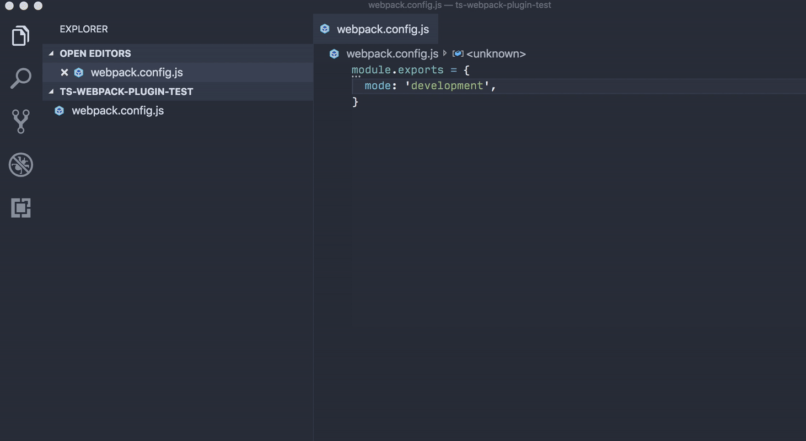

# TS Config Plugin

Just install the [VS Code extension](https://marketplace.visualstudio.com/items?itemName=octref.vscode-ts-config-plugin).

Or, `yarn add ts-config-plugin` and put this in tsconfig:

```json
{
  "compilerOptions": {
    "plugins": [
      { "name": "ts-config-plugin" }
    ]
  }
}
```

## Demo



## Supported Configs

- [x] webpack.config.js
- [ ] .eslintrc.js
- [ ] prettier.config.js / .prettierrc.js

## Notes

- The plugin only handles completion / diagnostics.
- This plugin is quite slow. I do hope it can be faster, but that needs more API from TypeScript.
- It's mainly for trying out TS Plugin, so I can use it for [Vetur](https://vuejs.github.io/vetur/) to build better typing experience for Vue 2 and the upcoming Vue 3.